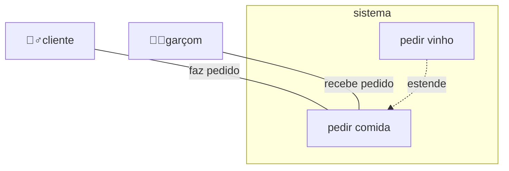

# trabalho-engenharia-software

Trabalho de engenharia de software do prof Henry em 2026-02

Este repositório é onde vou guardar meu trabalho da disciplina de engenharia de software.

## Diagrama UML 

